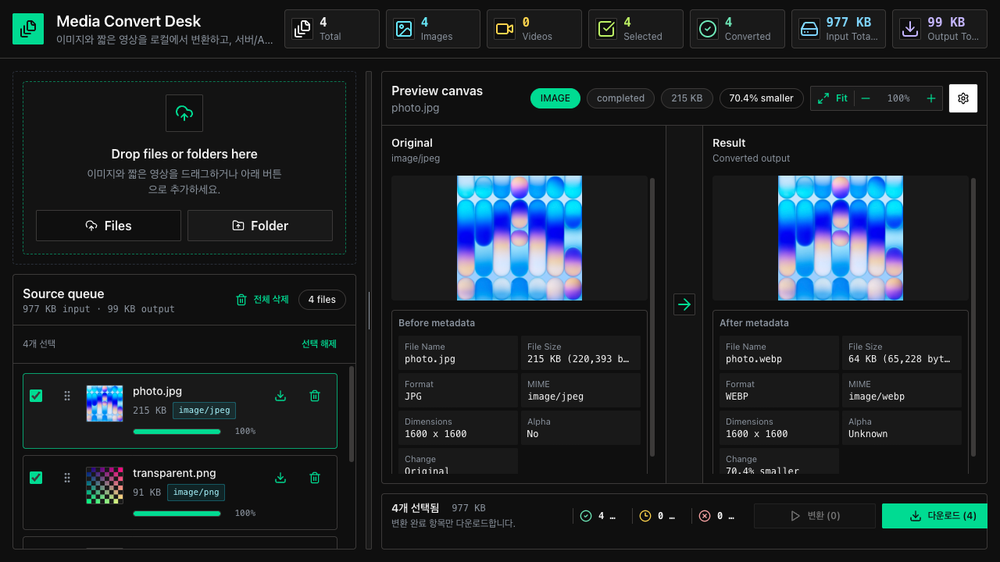
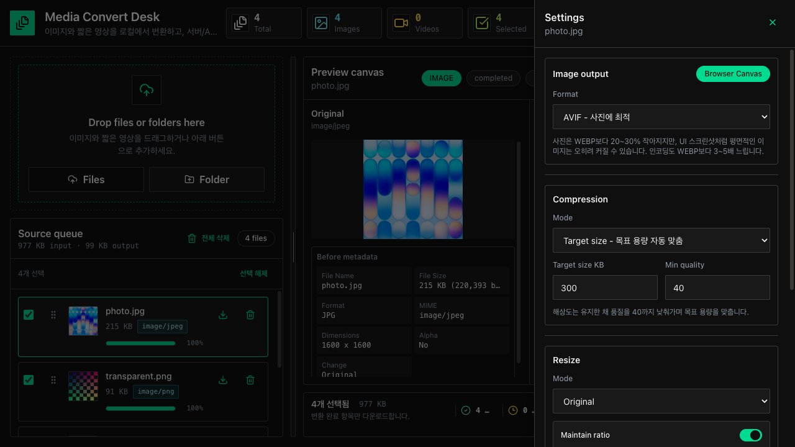

# Media Convert Desk

이미지와 짧은 영상을 **브라우저 안에서** 압축·변환하는 Next.js 대시보드입니다.

파일이 서버로 전송되지 않습니다. 디코딩·리사이즈·인코딩이 전부 사용자의 브라우저에서 일어나므로 업로드 대기가 없고, 원본이 외부로 나가지 않습니다.

---

## 1. 빠른 실행

```bash
npm install
npm run dev
```

브라우저에서 `http://localhost:3000`을 엽니다.

| 명령 | 설명 |
| --- | --- |
| `npm run dev` | 개발 서버 (Turbopack) |
| `npm run build` | 프로덕션 빌드 (webpack) |
| `npm run typecheck` | 타입 검사 |
| `npm test` | 전체 테스트 |
| `npm run test:watch` | 테스트 watch 모드 |

---

## 2. 사용 흐름

1. **`Files`** 또는 **`Folder`** 로 이미지·영상을 추가합니다.
2. Source queue에서 변환할 항목을 **체크**합니다.
3. 우측 **톱니바퀴**로 Settings를 열어 포맷·압축·리사이즈를 정합니다.
4. 하단 **`변환 (N)`** 으로 체크된 미변환 항목을 변환합니다.
5. **`다운로드 (N)`** 으로 결과를 저장합니다. 1개면 단일 파일, 여러 개면 ZIP입니다.

지원하지 않는 파일은 빨간 테두리로 표시되고 변환 대상에서 자동 제외됩니다. 상단 경고의 파일명을 클릭하면 해당 항목으로 스크롤됩니다.

### 화면 구성



- **상단** — Total / Images / Videos / Selected / Converted / Input·Output Total Size
- **좌측** — 업로드, Source queue (그룹·정렬·이름 변경·선택)
- **중앙** — Original / Result 비교 캔버스, 하단 변환·다운로드 액션바
- **우측** — Settings drawer



---

## 3. 압축 기능

이 앱의 핵심은 **해상도를 유지한 채 용량을 줄이는 것**입니다.

### 압축 모드 두 가지

| 모드 | 동작 |
| --- | --- |
| **Quality** | 품질(1~100)을 직접 지정합니다. |
| **Target size** | 목표 용량(KB)을 입력하면 품질을 **이진 탐색**해 그 이하로 맞춥니다. 해상도는 건드리지 않습니다. |

Target size 모드는 품질 하한선(`Min quality`, 기본 40) 아래로는 내려가지 않습니다. 하한선에서도 목표를 못 맞추면 실패시키지 않고 **가장 작은 결과 + 경고**를 돌려줍니다.

### 이미지 출력 포맷

| 포맷 | 특징 | 인코더 |
| --- | --- | --- |
| **WEBP** | 범용 권장. 대부분의 경우 가장 균형이 좋습니다. | 브라우저 내장 |
| **AVIF** | **사진**에서 WEBP 대비 20~30% 더 작습니다. 단 UI 스크린샷처럼 평면적인 이미지는 오히려 커질 수 있고, 인코딩이 3~5배 느립니다. | wasm libavif |
| **PNG** | 무손실. 인코딩 후 **oxipng**로 재압축합니다 (PNG→PNG 실측 -18%). 목표 용량은 보장할 수 없습니다. | 브라우저 + wasm oxipng |
| **JPG** | 호환성 우선. 투명 영역은 설정한 배경색으로 합성됩니다. | 브라우저 내장 |

**포맷 고르는 법**

- **사진** → AVIF (가장 작음). 인코딩 시간이 아깝다면 WEBP
- **UI 스크린샷·도형·로고** → WEBP. 실측상 1280×720 스크린샷은 AVIF가 WEBP보다 27% *더 컸습니다*
- **화질 손실이 절대 안 되는 원본 보관** → PNG
- **구형 환경 호환** → JPG

> ⚠️ **사진을 PNG로 바꾸면 커집니다.** PNG는 무손실이라 JPG 사진(306KB)을 PNG로 변환하면 1.3MB가 됩니다. PNG는 원래 PNG였던 이미지를 무손실로 더 줄이거나, 투명도가 필요할 때 쓰세요.

### 영상 출력

- 컨테이너: **MP4** 고정
- 코덱: **H.264** 고정
- 오디오: **Keep**(원본 스트림 복사) / **Compress**(AAC, 비트레이트 지정) / **Remove**(제거)
- 압축 강도: **CRF**(기본 26) 또는 **Bitrate**
- 목표 용량 입력 시 길이에서 비트레이트를 역산합니다 (단일 패스 추정이라 오차가 있습니다)

> `Keep`은 원본 오디오를 그대로 복사합니다. MP4가 담을 수 없는 코덱이면 변환이 실패하니 그럴 때는 `Compress`를 쓰세요.

### 안전장치

- **원본보다 커지면 원본을 유지합니다.** 같은 포맷·해상도 유지 조건에서 재압축 결과가 더 크면 원본 바이트를 그대로 내보내고 경고를 표시합니다.
- 변환 실패 시 사유와 기술 상세를 결과 패널에 표시합니다.
- 목표 용량 미달·무손실 포맷 한계도 경고로 알립니다.

---

## 4. 실측 성능

1920×1920 사진(원본 PNG 3.9MB), 로컬 개발 서버·교차 출처 격리 ON 기준입니다.

| 출력 | 소요 시간 | 결과 크기 | 메인 스레드 최대 블로킹 |
| --- | --- | --- | --- |
| AVIF | 1.6초 | 54 KB (-98.6%) | 100 ms |
| WEBP 목표 200KB | 3.3초 | 169 KB (-95.8%) | 82 ms |
| PNG 무손실 | 1.3초 | -18.4% | 48 ms |

인코딩은 **Web Worker**에서 실행되므로 변환 중에도 UI가 멈추지 않습니다. 위 "최대 블로킹"은 메인 스레드에 남겨둔 디코딩·리사이즈 구간입니다.

---

## 5. 아키텍처

```
파일 선택
  → 검증 (lib/validation)
  → 메타데이터 추출 (lib/media/metadata.ts)
  → [이미지] 디코드 + 리사이즈 (메인 스레드, Canvas)
       → ImageData 를 Worker 로 전달
       → 인코딩 · 목표 용량 탐색 (workers/image.worker.ts)
    [영상] FFmpeg.wasm (lib/ffmpeg/client.ts)
  → 결과 Blob → 미리보기 · 다운로드 · ZIP
```

디코딩과 리사이즈를 메인 스레드에 남긴 이유는 브라우저별 디코더 폴백(`decodeImageForCanvas`)이 Worker에서 동작하지 않기 때문입니다. 실제로 느린 구간은 wasm 인코딩이라 이 분할로 프리징이 사라집니다.

Worker를 만들 수 없는 환경에서는 `lib/image/encode-client.ts`가 **동일한 로직을 메인 스레드에서** 수행합니다. 결과는 같고 UI가 잠시 멈출 뿐입니다.

### 디렉터리

```txt
app/            라우트, API 스텁
components/ui/  shadcn 스타일 primitive
constants/      기본 옵션, 지원 포맷, 용량 제한
features/       화면 단위 컴포넌트 (upload/media/image/video/download)
lib/
  ffmpeg/       영상 인자 생성 · FFmpeg.wasm 클라이언트
  image/        인코더 · 목표 용량 탐색 · Worker 클라이언트
  media/        파일명 · 리사이즈 · 압축 규칙 · ZIP · 메타데이터
  validation/   업로드 검증
stores/         Zustand 상태
workers/        이미지 인코딩 Worker
```

### 기술 스택

Next.js App Router · React · TypeScript · Tailwind CSS · Zustand · Vitest
Canvas / OffscreenCanvas · `@jsquash/avif` · `@jsquash/oxipng` · FFmpeg.wasm · JSZip · file-saver

---

## 6. 배포 시 확인할 것

`next.config.mjs`가 **COOP/COEP 헤더**를 설정합니다.

```
Cross-Origin-Opener-Policy: same-origin
Cross-Origin-Embedder-Policy: require-corp
```

이 헤더가 있으면 교차 출처 격리가 켜지고, Worker 안의 wasm 인코더가 멀티스레드 빌드로 승격됩니다. 실측상 **1920×1920 AVIF 인코딩이 2639ms → 1444ms(1.8배)** 로 빨라집니다.

- 헤더가 전달되지 않아도 **기능은 정상 동작**합니다. 속도만 느려집니다.
- 정적 export나 CDN 직접 서빙이면 `next.config.mjs` 대신 **호스트에서** 같은 헤더를 설정해야 합니다.
- **주의**: `require-corp`는 CORP/CORS 헤더가 없는 교차 출처 리소스를 차단합니다. 현재 외부 리소스는 FFmpeg 코어를 받는 unpkg 하나뿐이며 `CORP: cross-origin`을 보냅니다. 외부 폰트·이미지·스크립트를 추가할 때는 해당 호스트의 헤더를 먼저 확인하세요.

---

## 7. 제한 사항

### 영상 용량·길이

브라우저 메모리 한계로 기본 제한이 있습니다. 초과 시 서버 처리를 안내하는 메시지가 표시됩니다.

| | 용량 | 길이 |
| --- | --- | --- |
| 데스크톱 | 100 MB | 2분 |
| 모바일 | 50 MB | 1분 |

### WEBM 출력 · H.265 코덱 불가

둘 다 UI에서 **비활성화**되어 있습니다. 브라우저 FFmpeg 인코더의 한계이며, 검증 결과는 다음과 같습니다.

| | 증상 | 확인 범위 |
| --- | --- | --- |
| **WEBM (VP8/VP9)** | 인코더 초기화 직후 `memory access out of bounds`로 크래시 | 코어 0.12.6 / 0.12.9 / 0.12.10, 단일·멀티스레드, `-threads 1` · `-row-mt` · `-deadline realtime` · VP8 대체 전부 재현 |
| **H.265 (libx265)** | 크래시는 없으나 실용 불가능하게 느림 — 2초 320×240 클립이 **5분 넘게 18%** | 기본 인자 |

WEBM은 **입력**으로는 정상 지원됩니다.

### 서버 API

MVP에서는 서버 처리를 수행하지 않습니다. 아래는 계약 고정을 위한 `501 Not Implemented` 스텁입니다.

```txt
POST   /api/images/convert     POST   /api/videos/convert
POST   /api/images/enhance     POST   /api/videos/enhance
POST   /api/jobs               GET|DELETE /api/jobs/:id
```

### 그 외 미구현

AI 화질 개선 · 대용량 서버 큐 · AV1 코덱(FFmpeg 코어에 인코더 자체가 없음) · GIF 변환 · 구간 자르기 · FPS 변경

---

## 8. 검증

```bash
npm run typecheck   # 0 errors
npm test            # 29 files / 155 tests
npm run build       # 성공 (jsquash wasm 관련 경고 2건은 무해)
```
